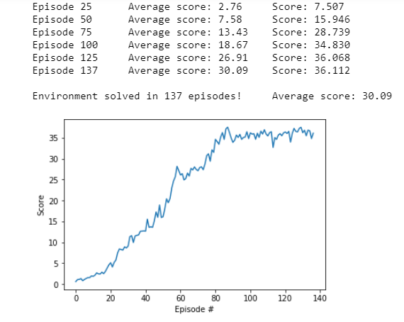

# Report
This report presents the approach taken to solve the Continuous Control project of Udacity's Deep Reinforcement Learning Nanodegree Program. The results are shown and directions for future work are mentioned.

## Approach
To solve this project an implementation was used of the Deep Deterministic Policy Gradient algorithm. DDPG is a common algorihtm for learning continuous control. This implementation is reusing the DDPG implementation DDPG-Pendulum that was provided with the Udacity drlnd repository. This was adjusted to support multiple parallel agent instances.  
Supporting multiple parallel agent instances could be be done in different ways. The approach taken was to have a single agent with a single replay memory processing 20 parallel states per time step and have a single learning update per time step. This was converging better then having 20 seperate agent instances with shared networks and independent learning steps and replay memories. 
This makes sense because using a single replay memory takes advantage of having more randomness in states.

### Agent hyperparameters
The agent uses the following hyperparameters:
- **BATCH_SIZE** (128): size of the mini-batches
- **BUFFER_SIZE** (1e5): size of the replay buffer
- **GAMMA** (0.99): discount factor
- **LR_ACTOR** (1e-4): learning rate of the Adam optimizer for the actor
- **LR_CRITIC** (1e-3): learning rate of the Adam optimizer for the critic
- **TAU** (1e-3): interpolation factor for the soft update of the target network
- **WEIGHT_DECAY** (0): L2 weight decay for the Adam optimizer for the critic.

### Neural network architectures
The neural network architectures are the same as for the DDPG-Pendulum.

The **Actor** maps each state of the environment to an action, which is a vector of four numbers between -1 and +1. 
The network consists of three fully-connected linear layers with ReLU activation functions. The output layer uses the `tanh` activation function to produce values between -1 and +1 for each of the four outputs. The first hidden layer consists of 400 units, whereas the second hidden layer consists of 300 units.

The **Critic** maps a state and action to an estimated Q-value, which reflects the estimated quality of the given action in the given state. The network consists of three fully-connected linear layers with ReLU activation functions. The output layer produces the estimated value of the given action in the given state. The first hidden layer consists of 400 units, whereas the second hidden layer consists of 300 units.

## Results

The 20 agents solved the environment in 137 episodes obtaining an average reward of +30.09 over the last 100 episodes.

## Future work
The following future work directions are worth exploring:
* Implement **Q-PROP** algorithm (https://arxiv.org/abs/1611.02247) and compare results.
* Implement **TRPO** algorithm (https://arxiv.org/abs/1502.05477) and compare results.
