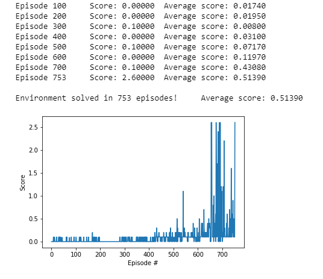

# Report
This report presents the approach taken to solve the Collaboration and Competition project (Tennis) of Udacity's Deep Reinforcement Learning Nanodegree Program. The results are shown and directions for future work are mentioned.

## Approach
To solve this project an implementation was used of the Multi Agent Deep Deterministic Policy Gradient algorithm (**MADDPG**, https://papers.nips.cc/paper/7217-multi-agent-actor-critic-for-mixed-cooperative-competitive-environments.pdf). 
MADDPG is a multi-agent version of DDPG where each agent's actor receives an agent specific state but each agent's critic receives the states and actions of all agents.
For this Tennis project we have two agents for the two tennis players. 
The biggest challenge was to get the agents starting to learn because in the beginning they receive a lot of zero rewards.
Because the agents use deterministic policies it was important to add enough noise the let them explore in order to receive non-zero rewards.
It appeared to be effective to start with 200 episodes of pure random actions to get some non-zero reward experiences to learn from.
When the agents started to learn I could optimize the learning by tuning in particular the BATCH_SIZE, TAU, NOISE_SCALE and NOISE_REDUCTION parameters. 
 
### Agent hyperparameters
The agent uses the following hyperparameters:
- **BATCH_SIZE** (256): Minibatch size
- **BUFFER_SIZE** (1e5): Replay buffer size
- **GAMMA** (0.99): Discount factor
- **LR_ACTOR** (1e-4): Learning rate of the actor
- **LR_CRITIC** (1e-3): Learning rate of the critic
- **TAU** (1e-2): Parameter for soft update of target parameters
- **WEIGHT_DECAY_ACTOR** (0): Weight decay for the actor 
- **WEIGHT_DECAY_CRITIC** (0): Weight decay for the critic
- **N_LEARN_UPDATES** (1): Number of learning updates per step
- **N_TIME_STEPS** (1): Learning every N_TIME_STEPS
- **NOISE_SCALE** (0.2): Amount of noise without reduction
- **NOISE_REDUCTION** (0.9999): Noise reduction factor

### Neural network architectures
The two agents have neural networks for both **Actor** and **Critic**. 

The **Actor** reveives the state observed by the agent and maps it an action, which is a vector of two numbers between -1 and +1. 
The network consists of three fully-connected linear layers with ReLU activation functions. The output layer uses the `tanh` activation function to produce values between -1 and +1 for each of the outputs. The first hidden layer consists of 256 units, whereas the second hidden layer consists of 128 units.

The **Critic** receives the states and actions of both agents and maps it to an estimated Q-value, which reflects the estimated quality of the given actions in the given states. The network consists of three fully-connected linear layers with leaky ReLU activation functions. The states are input to the first layer and the actions are added to the second layer. This helps in combining the state and action info in a more effective way. The first hidden layer consists of 256 units, whereas the second hidden layer consists of 128 units.

## Results

The 2 agents solved the environment in 753 episodes obtaining an average score of +0.51390 over the last 100 episodes.

## Future work
The following future work directions are worth exploring:
* User Prioritized Experience Replay (https://arxiv.org/pdf/1511.05952.pdf) to make more effective use of non-zero rewards from the Replay buffer.
* Apply the implementation of **MADDPG** to environments where agents have to do both collaboration and competition.
* Apply the implementation of **MADDPG** to environments where agents have limited observability of the environment state.
